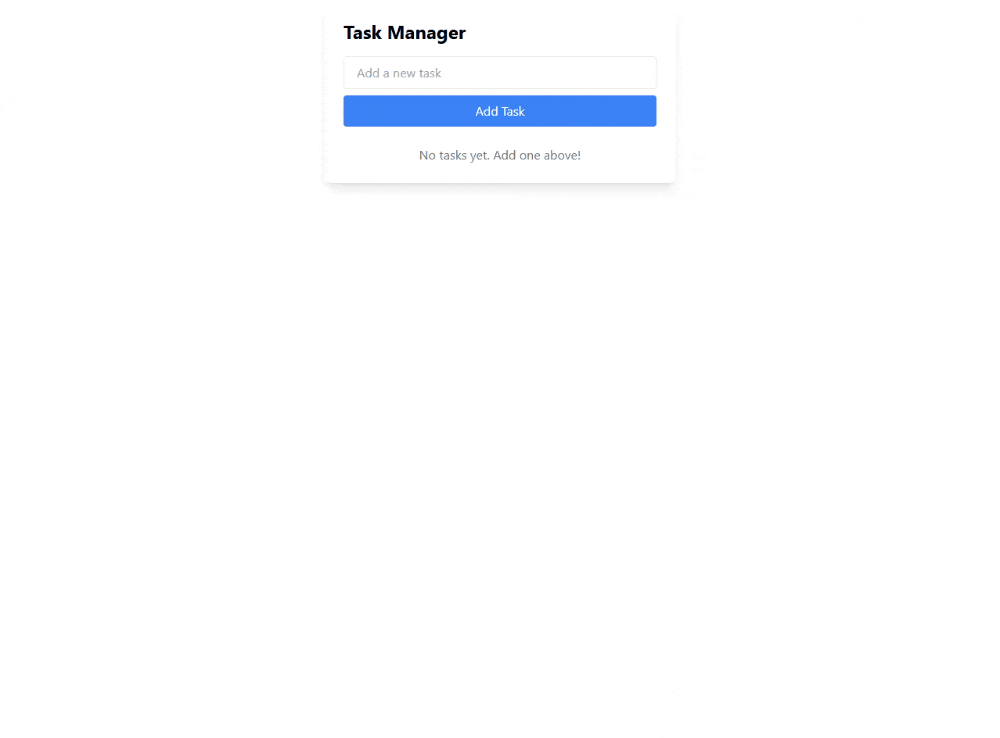
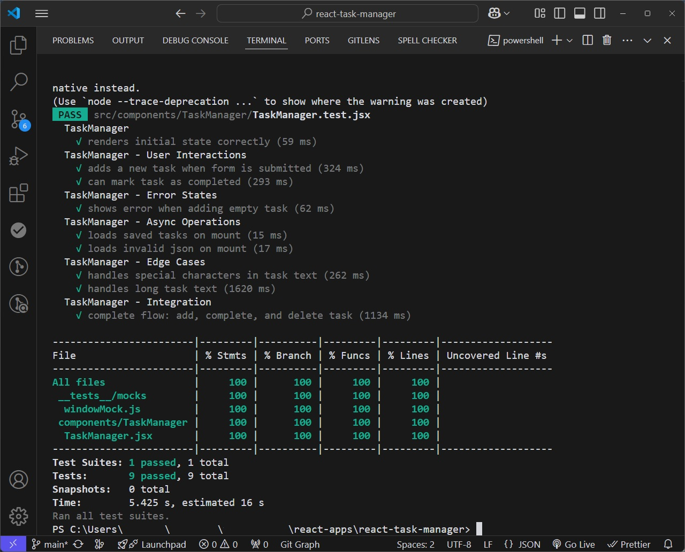

# 📝 React Task Manager with Jest Testing Tutorial

A simple React task manager application built to demonstrate Jest unit testing best practices in React applications.



## 🎯 Overview

This project serves as a practical example for learning how to:

- Write unit tests using Jest and React Testing Library
- Test React components and hooks
- Mock browser APIs like localStorage
- Achieve high test coverage
- Structure test files and test suites

## ✅ Test Coverage Results

The project maintains 100% test coverage across all components:

;

## ⭐ Features

- Add, complete and delete tasks
- Persistent storage using localStorage
- Form validation
- Task completion tracking
- Clean and accessible UI using Tailwind CSS

## 🛠️ Technologies

- React 18
- Jest
- React Testing Library
- Tailwind CSS
- Vite

## 🚀 Getting Started

```bash
# Install dependencies
npm install

# Run development server
npm run dev

# Run tests
npm test

# Run tests with coverage
npm run test:coverage
```

## Learn More

For a detailed walkthrough on how to implement Jest testing in React applications, check out the full tutorial:

- [🧪 React Unit Testing: A Complete Guide with Jest & Testing Library - Part 1: Unit Tests and Their Importance](https://www.joaovinezof.com/blog/react-unit-testing-guide-jest-testing-library)
- [🛠️ React Unit Testing: A Complete Guide with Jest & Testing Library - Part 2: Configuring Your React Project for Unit Testing](https://www.joaovinezof.com/blog/react-unit-testing-guide-jest-testing-library-part-2)
- [🧪 React Unit Testing: A Complete Guide with Jest & Testing Library - Part 3: Testing Components with Jest](https://www.joaovinezof.com/blog/react-unit-testing-guide-jest-testing-library-part-3)